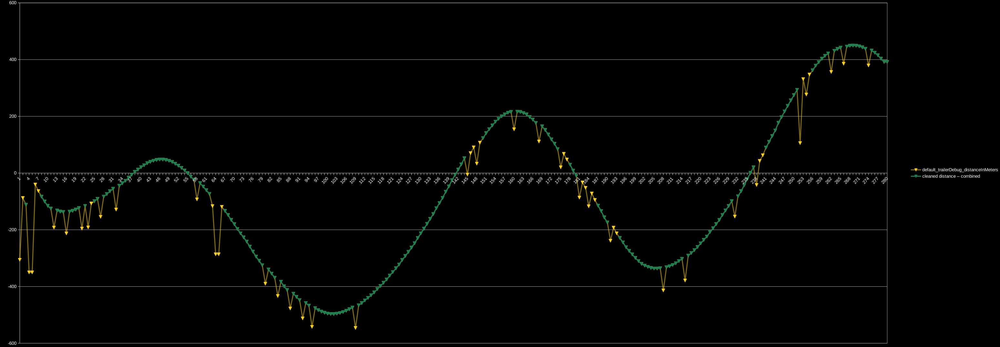
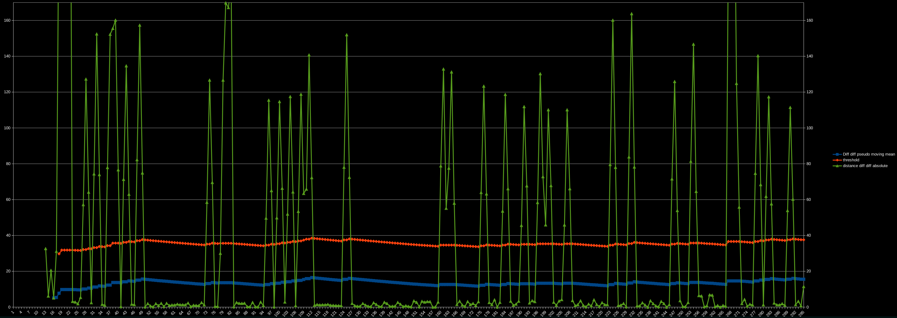

# CleanStream

For cleaning a stream of data.



Note that at the time of this writing; this package has been tested with a single dataset. With other datasets, it might work out of the box, with some tweaking, or not at all. Start by messing with the `offset`.

## Behaviour

### The decisions

streamClean tracks the differences of the differences of the dataIn, henceforth diffDiff

It keeps a pseudo moving-mean of the diffDiff to compare against. This value has a `multiplier` and `offset` applied and is then is used as the threshold for all further tests.

The current value is diff'ed against the previous, second previous, and third previous values, and each is compared against the threshold.

### The result

Assuming this is the command you ran:

```
cleanStream Data,stream1,~!Local,value!~,100,22,1
```

If the datapoint is deemed to be clean, it will appear in the `Data,stream1,dataOut`. And `Data,stream1,mute` will be set to `0`.

Otherwise `Data,stream1,dataOut` will be empty, and `Data,stream1,mute` will be set to `1`.

## Usage

### Syntax

```
cleanStream Category,variable,dataIn,meanSize,offset,multiplier
```

* Where to put the output
    * Category
    * variable
* Input
    * dataIn
* Tuning
    * meanSize - optional (default: 100)
    * offset - optional (default: 22)
    * multiplier - optional (default: 1)
    * meanSeed - optional (default: 5)

### Tuning



* The green line is data that we are going to test, derived from changes in dataIn.
* The blue line is that same data, but with a pseudo moving mean applied. - The size of this moving mean is defined by the `meanSize`.
* The orange line is the same as the blue line, but with the `multiplier` and `offset` applied.
    * `multiplier` will raise the line up, but it will also make the peaks and troughs larger as well.
    * `offset` shifts the whole line.
    * `meanSeed` gives the pseudo moving mean a starting point. This needs to be a realistic good value. Previously I used the first real value. But if the first value was bad, it would take a while to settle to a correct level.

Some guidelines:

* Mess with the `meanSize` to change the responsiveness to legitimate changes in data.
* Mess with the `multiplier` to create contrast between the highs and lows.
* Mess with the `offset` to globally change where the threshold is.

### Output

Assume that you have run it like this:

```
cleanStream Data,stream1,~!Local,value!~,100,22,1
```

There are two variables in the output that will be useful to you:

* `Data,stream1,dataOut` - The value that you can use.
* `Data,stream1,mute` - Whether we have skipped this data point.

#### dataOut

At the time of this writing, the current behaviour is to return an empty string when `mute` is 1. This may change. Check back here for the official answer.

#### mute

When we identify that a given value is bogus, we set `mute` to `1`. When `mute` is `1`, we should not make decisions on the data.

## Other notes

### Compatibility with Local/Me

It should work with Local and Me variables. However for most use-cases this won't make sense because they often need to exit below the scopes in which the Local/Me variable would be discarded. It could still be useful for a `loop` that processes the data from start to finish.
